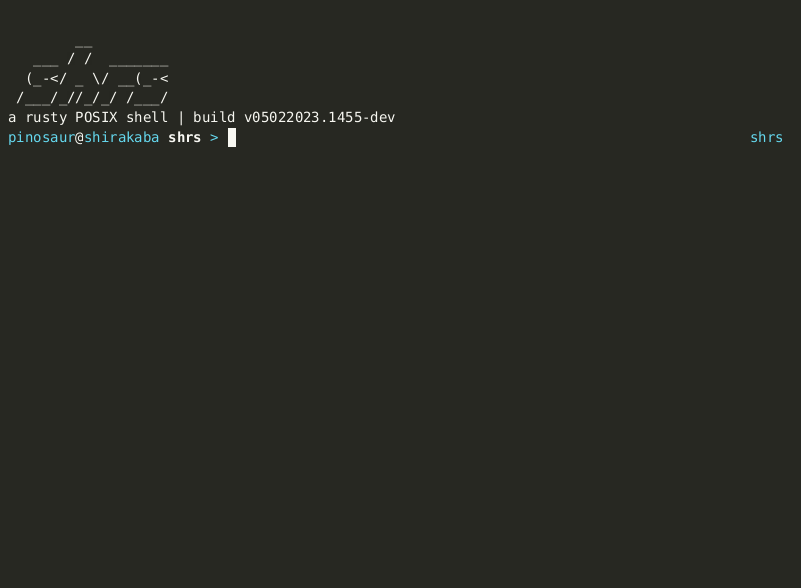

<div align="center">


The rusty shell toolkit for hackers

[](https://crates.io/crates/shrs)
[](https://docs.rs/shrs)
[](https://mrpicklepinosaur.github.io/shrs/docs/getting-started/introduction/)
[](#)
[](https://discord.gg/XYeMseQrbM)

</div>

## PROJECT GOALS

- **hackable**: almost every aspect of the shell should be easily customizable and extendable
- **developer friendly**: well documented and easy to contribute to
- **rusty**: implemented in and configurable in rust

## FEATURES



DISCLAIMER: **shrs** is currently very much a work in progress, the API is subject to change frequently and things are prone to breaking. It currently may not be suitable for daily use, but is great for prototyping any experimental shell features you dream up with!

Here are what makes **shrs** special:
- Completely configurable in rust (including your prompt, completions and more!)
- Plugin system (community maintained plugins that add unique features)

## GETTING STARTED

To get a taste of what **shrs** is capable of, without any configuration, you can run the example **shrs_example** shell that is bundled by running:
```sh
git clone https://github.com/MrPicklePinosaur/shrs.git
cd ./shrs/shrs_example
cargo run
```

To get started with building your own shell, it's as easy as creating a new cargo project with:
```rust
use shrs::prelude::*;

fn main() {
    let myshell = ShellBuilder::default()
        .build()
        .unwrap();

    myshell.run();
}
```

See the [developer documentation](https://mrpicklepinosaur.github.io/shrs/docs/getting-started/introduction/) for more in depth information.

## CONTRIBUTING

If you encounter and bugs are have any feature requests, please don't hesitate to [leave an issue](https://github.com/MrPicklePinosaur/shrs/issues)! Also take a look at the section for contributors in the [documentation](https://mrpicklepinosaur.github.io/shrs/docs/contributing/how-to-contribute/).

## COMMUNITY PLUGINS

List of cool 3rd part plugins (create a PR to add yours to this list):

- [shrs_insulter](https://github.com/nithinmuthukumar/shrs_insulter): port of [bash insulter](https://github.com/hkbakke/bash-insulter)
- [shrs_reedline](https://github.com/MrPicklePinosaur/shrs_reedline): adapter layer to use [reedline](https://github.com/nushell/reedline) instead of shrs line

## COMMUNITY SHELLS

Full shells that were built with shrs

- [pinosh](https://github.com/MrPicklePinosaur/pinosh): MrPicklePinosaur's build of shrs

